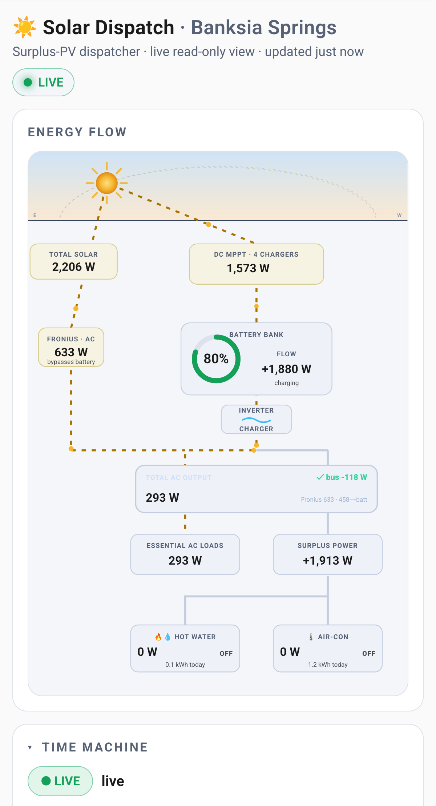
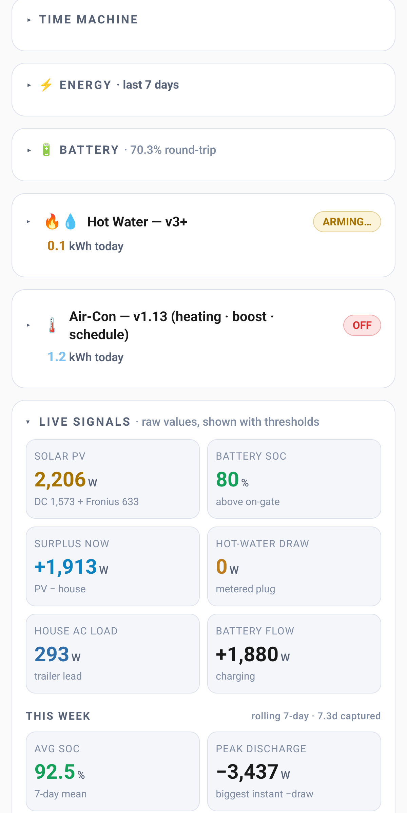
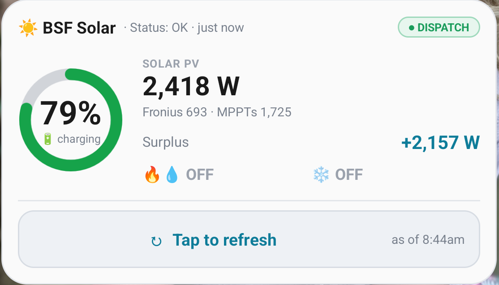

# BSF Solar Dispatch ☀️

**A surplus-PV dispatcher for Victron Cerbo + Tuya.**

[](https://github.com/banksiaspringsfarm-rgb/bsf-solar-dispatch-starter/releases/latest)
[](LICENSE.md)
[](#install-via-claude-code-15-min)

When your battery hits 100% by mid-morning and the panels spend the rest of the day
throttled back, you're throwing away free power. BSF Solar Dispatch watches your **Victron
Cerbo GX**, and the moment there's genuine surplus solar it switches **Tuya / Smart-Life
smart plugs** on — hot-water element, air-con, pumps — to soak up the power that would
otherwise be curtailed, then backs off the instant the surplus is gone or the battery
needs it. It's not a thermostat with a solar sticker on it: it's a *surplus dispatcher*
with a real safety envelope — battery state-of-charge windows, a hard night-time lockout,
load caps, and presence-aware air-con — built and run on a working Queensland farm.

---

## What it looks like

| Energy flow | Live signals | Android widget |
|---|---|---|
|  |  |  |

*Live from the farm: a 2.2 kW morning, battery at 80% and charging, +1.9 kW surplus, hot water arming.*

---

## Download

📦 **[Download the latest release ZIP →](https://github.com/banksiaspringsfarm-rgb/bsf-solar-dispatch-starter/releases/latest)**

Every version ships as a downloadable bundle on the [Releases page](https://github.com/banksiaspringsfarm-rgb/bsf-solar-dispatch-starter/releases). The direct link for v1.0.0 is:

```
https://github.com/banksiaspringsfarm-rgb/bsf-solar-dispatch-starter/releases/download/v1.0.0/bsf-solar-dispatch-starter.zip
```

---

## Install via Claude Code (~15 min)

The whole point of this bundle is that you don't wire it together by hand.

**One line, on the Mac / Linux box / Raspberry Pi that lives on the same network as your Cerbo:**

```bash
curl -fsSL https://raw.githubusercontent.com/banksiaspringsfarm-rgb/bsf-solar-dispatch-starter/main/install.sh | sh
```

It checks Python, installs Claude Code if you don't have it, downloads this bundle to
`~/bsf-solar-dispatch`, and opens Claude Code in it. Claude's first ask is **photos of your
gear** (inverter, battery, hot-water unit, switchboard) — it identifies what you've got and
tells you what will work *before* the config interview. Read [`install.sh`](install.sh) first
if you like; it's 100 lines and touches nothing but that folder. You need your own Claude
subscription.

Or by hand:

1. **[Download the release ZIP](https://github.com/banksiaspringsfarm-rgb/bsf-solar-dispatch-starter/releases/latest)** and unzip it.
2. Open the folder with **Claude Code** or **Cowork** (`claude` in the folder, or open it in the app).
3. Say: **"Install BSF Solar Dispatch."**

Claude reads the included runbook ([`CLAUDE.md`](CLAUDE.md)) and does the fiddly parts —
interviewing you to fill in `config.json`, deploying the dispatcher flow to your Cerbo,
installing the relay as a background service, and smoke-testing that live data is actually
flowing. Roughly **15–30 minutes**, most of it the one-time Tuya cloud setup.

**You** only do the sign-ups, because Claude can't sign in as you (security): creating a
Tuya developer account and scanning a QR code with the Smart Life app. That Tuya setup is
the fiddly part of the whole thing — which is exactly the part the bundle exists to make
painless. There's a manual install path in the [Manual install](#manual-install-if-youd-rather)
section if you'd rather drive it yourself.

---

## Hardware compatibility

| You need | Details |
|---|---|
| **Victron Cerbo GX** (or any Venus OS device) running **Node-RED** | The standard Victron Large image, or Node-RED installed on Venus OS. |
| **Tuya / Smart Life smart plugs** | One per load you want to switch (hot-water element, air-con, pump…), already paired in a Smart Life / Tuya Smart app account. |
| **A computer on the same LAN as the Cerbo** | Runs the read-only dashboard relay. macOS or Linux, Python 3.8+. A Raspberry Pi is ideal. |
| **Any phone** | The dashboard is a web page — iPhone or Android. "Add to Home Screen" makes it a full-screen app. Optional native home-screen widgets for both (Android APK; iOS via the free **Scriptable** app). |
| **Claude Code or Cowork** | To run the guided install. |

Battery chemistry is configurable (lead-acid / LiFePO₄ / lithium-ion → the correct SOC
bands), as is your array, charger count, plug count, thresholds, safety caps, and location.
The defaults describe a typical Aussie Victron + lead-acid + ~5 kW rig; a different rig just
answers the questions that matter. Nothing is hard-coded to one farm.

---

## What's in the bundle

| Path | What it is |
|---|---|
| [`node-red/bsf-solar-dispatch.flow.json`](node-red/bsf-solar-dispatch.flow.json) | The dispatcher — the brain. Imports into your Cerbo's Node-RED. Hot-water state machine, canonical Victron curtailment detection, air-con thresholds, presence gate, night lockout, load caps. |
| [`dashboard/solar_dispatch_dashboard.html`](dashboard/solar_dispatch_dashboard.html) | Single-file phone dashboard: live energy-flow diagram, SOC ring, per-charger solar breakdown, sun/moon horizon arc, weekly stats. |
| [`publisher/solar_state_publisher.py`](publisher/solar_state_publisher.py) | Read-only relay that reads the Cerbo and feeds the dashboard. Stdlib + `paho-mqtt`. |
| [`widget/android/`](widget/android/) · [`widget/ios/`](widget/ios/) | Optional home-screen widgets — Android `.apk`; iPhone via the free Scriptable app. |
| [`install/`](install/) | `deploy.py` installer + Tuya setup walkthrough, region→data-center map, troubleshooting. |
| [`config.example.json`](config.example.json) | The one system-config file. The wizard fills a copy (`config.json`). |
| [`CLAUDE.md`](CLAUDE.md) | The install runbook Claude Code reads to set this up for you. |

---

## Manual install (if you'd rather)

```bash
cp config.example.json config.json      # then edit config.json with your values
python3 -m pip install -r publisher/requirements.txt
python3 install/deploy.py check          # validate config + reach the Cerbo
python3 install/deploy.py flow --deploy   # stamp config in + push the flow to the Cerbo
python3 install/deploy.py publisher       # install the relay as a service
python3 install/deploy.py dashboard       # write dashboard-config.js
python3 install/deploy.py smoke           # confirm live data is flowing
```

Then serve the dashboard from the relay's data dir
(`cd ~/bsf-solar-dispatch/dispatch-host && python3 -m http.server 8780`) and open it on
your phone. `config.json`, `dashboard-config.js`, `devices.json` and the `.build/` output
hold your real credentials and are **git-ignored** — keep them private.

---

## A note on safety

The dispatcher controls real electrical loads off a battery bank. It ships with
conservative defaults (SOC windows, a night lockout, load caps). **Understand the flow
before you widen those limits.** Switching big resistive loads off a lead-acid bank at
night will hurt the bank. If you're not sure, leave the defaults and watch it on the
dashboard for a few days first.

---

## What this *won't* do

- ❌ Won't run on non-Victron systems — it reads a Victron Cerbo / Venus OS over MQTT.
- ❌ Won't control non-Tuya plugs (no Shelly, Zigbee, or Z-Wave out of the box).
- ❌ Won't do true *cooling* dispatch as-shipped — it ships heating-direction; reversing it is a documented manual step.
- ❌ Won't sign in to Tuya or create accounts for you — those sign-ups are yours to do.
- ❌ Won't work without Node-RED on the Cerbo, or without a LAN host for the relay.
- ❌ Won't nag, lock or expire — it's free for personal use. There's a ☕ link on the dashboard if you want to say thanks.
- ❌ Won't carry a warranty or safety certification — you run it at your own risk.

---

## Free, and a coffee if you like

It's **free for personal and non-commercial use, forever** — source is right here, use it,
change it, share it. It runs on my farm and
I built it because the Victron community's Node-RED threads got me this far; this is me
putting something back. If it's earning its keep at your place, a coffee is a nice way
to say so. The ☕ on the dashboard goes to the same place. Never required, never nags
more than once, never touches dispatch.

☕ **[Buy Steven a coffee →](https://ko-fi.com/banksiaspringsfarm)**

Support is community-flavoured — no SLA, no helpdesk. If something misbehaves, paste the
error into Claude Code; [`install/troubleshooting.md`](install/troubleshooting.md) covers
the common ones. Not affiliated with Victron or Tuya.

---

## Licence

[PolyForm Noncommercial 1.0.0](LICENSE.md). Free for personal and non-commercial use, no
expiry; commercial use (selling it, installing it for paying customers, bundling it) needs
Steven's permission — just ask. No warranty: it switches real electrical loads, so you run it
at your own risk.

---

*Built on the Granite Belt, Queensland. If it saves you some power, you know what to do. ☕*
